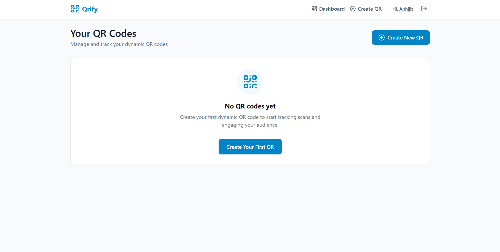
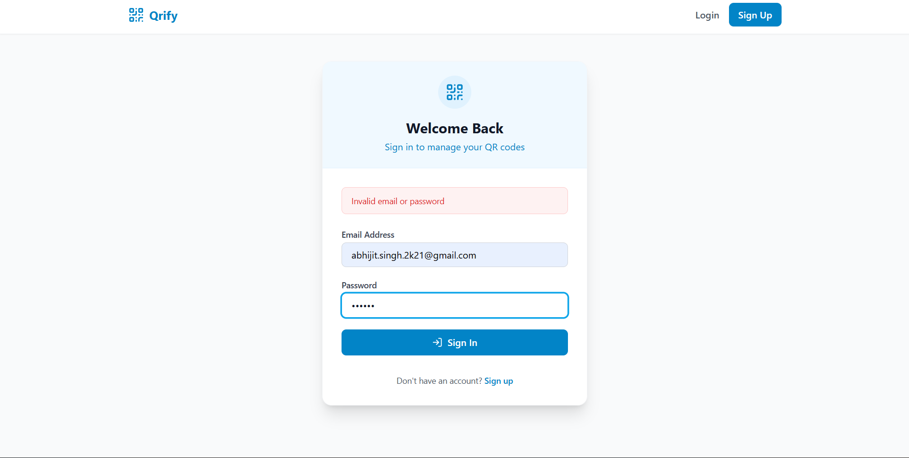

# Qrify - Dynamic QR Code Generator

Qrify is a modern, full-stack web application that allows users to create, manage, and track dynamic QR codes. Built with a sleek UI and a robust backend, Qrify provides everything you need for personal or business QR code management.

## 🚀 Features

- **Multiple QR Types**: Generate QR codes for URLs, Rich Text, Emails, Phone Numbers, WiFi Credentials, and vCards.
- **Advanced Controls**: Add password protection, set expiry dates, or make QR codes single-use.
- **Analytics**: Track total scans for each generated QR code.
- **Dynamic Redirection**: Update the destination of a QR code anytime without changing the physical code.
- **Secure Authentication**: Complete JWT-based user signup and login system.
- **Beautiful & Responsive**: Clean UI designed with TailwindCSS.

## 📸 Screenshots

### 1. User Dashboard
Track and manage all your generated QR codes in one place.


### 2. Create New QR Code
Intuitive interface for generating customized QR codes with advanced options.


### 3. Authentication
Secure login and signup flow.


## 💻 Tech Stack

**Frontend:**
- React (Vite)
- Tailwind CSS
- React Router DOM
- Axios
- Lucide React (Icons)

**Backend:**
- Node.js & Express
- MongoDB & Mongoose
- JSON Web Tokens (JWT) for Authentication
- bcrypt (Password Hashing)
- `qrcode` npm package

## 🛠️ Local Setup

1. **Clone the repository:**
   ```bash
   git clone https://github.com/abhijitsingh003/QRify.git
   cd QRify
   ```

2. **Backend Setup:**
   ```bash
   cd backend
   npm install
   # Create a .env file and add your PORT, MONGO_URI, JWT_SECRET, BASE_URL, FRONTEND_URL
   npm run dev
   ```

3. **Frontend Setup:**
   ```bash
   cd frontend
   npm install
   # Create a .env file and add VITE_API_BASE_URL
   npm run dev
   ```
